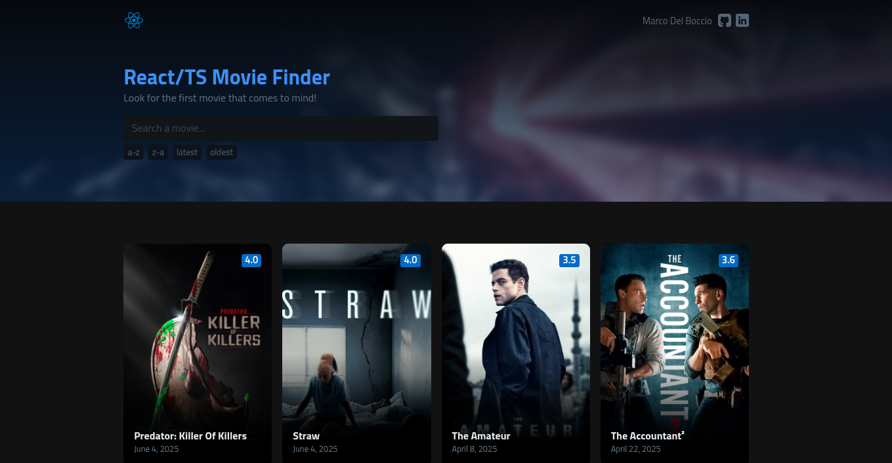
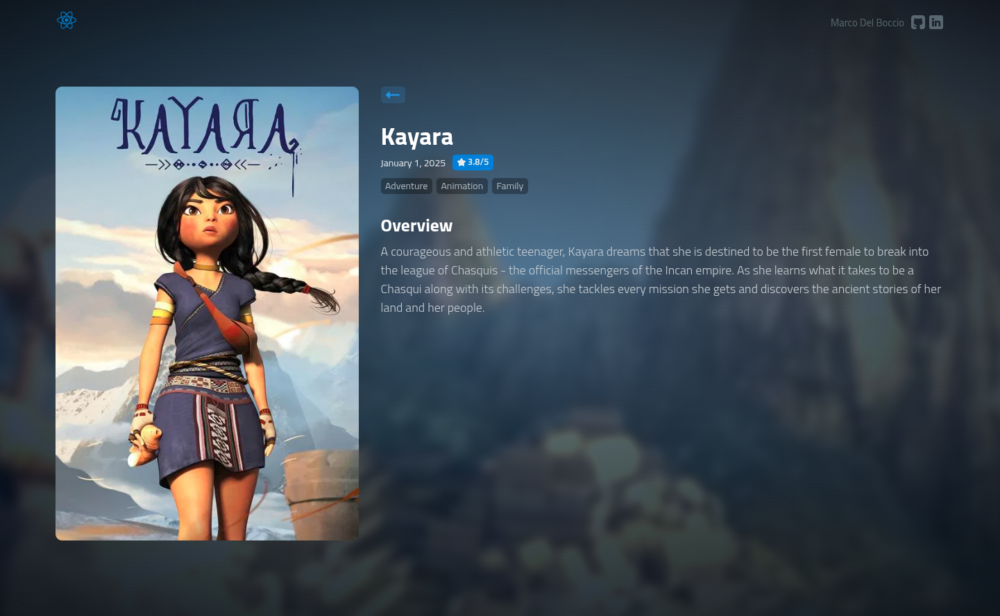
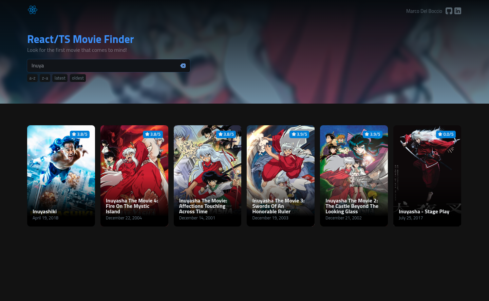

# Movie Finder App

Una aplicación web moderna para descubrir y explorar películas consumidas desde el API de TMDB, construida con React 19, TypeScript y React Router.

## Screenshots

| Página Principal                                  | Página de Detalle                                     | Búsqueda                                              |
| ------------------------------------------------- | ----------------------------------------------------- | ----------------------------------------------------- |
|  |  |  |

## Características Principales

### Búsqueda Inteligente

- Búsqueda en tiempo real con debounce optimizado
- Persistencia de búsquedas en URL mediante query parameters
- Integración con React Router para navegación fluida

### Páginas de Detalle

- Vista detallada de cada película con información completa
- Navegación entre páginas con React Router
- Diseño responsive con imágenes de fondo dinámicas

### Sistema de Ordenación

- Ordenación por título (A-Z, Z-A)
- Ordenación por fecha (más recientes/antiguas)
- Estado persistente durante la navegación

### Interfaz Moderna

- Diseño completamente responsive
- Componentes reutilizables y modulares
- Transiciones suaves y feedback visual
- Manejo de estados de carga y errores

## Tecnologías

- **React 19** - Framework principal
- **TypeScript** - Tipado estático
- **React Router 7** - Enrutamiento y navegación
- **Sass** - Preprocesador CSS
- **Vite** - Build tool y dev server
- **TMDB API** - Datos de películas

## 📁 Estructura del Proyecto

```
src/
├── assets/          # SVGs y recursos estáticos
├── components/      # Componentes React reutilizables
├── hooks/           # Hooks personalizados
├── pages/           # Páginas de la aplicación
├── scss/            # Estilos organizados
│   ├── base/        # Variables y tipografía
│   ├── components/  # Estilos por componente
│   └── pages/       # Estilos por página
├── utils/           # Funciones utilitarias
└── types.d.ts       # Definiciones TypeScript
```

## 🔧 Componentes Principales

### App.tsx

Componente raíz que configura el enrutamiento con React Router:

- Ruta principal redirige a `/movies`
- Página de detalle en `/movie/:id`
- Página 404 para rutas no encontradas

### HomePage

Página principal que integra:

- Componente Hero con búsqueda y ordenación
- Grid de películas con estado de carga
- Manejo de errores de API

### MovieDetailPage

Página de detalle individual que muestra:

- Información completa de la película
- Imagen de fondo dinámica
- Navegación de regreso
- Géneros y puntuación

### Hooks Personalizados

#### useMovies

Hook principal para gestión de películas:

- Integración con React Router para query parameters
- Debounce optimizado para búsquedas
- Gestión de película destacada
- Estados de carga y error

#### useMovieDetail

Hook para detalles de película individual:

- Fetch de datos específicos por ID
- Formateo de datos de la API
- Manejo de errores específicos

## Mejoras Implementadas

### Arquitectura

- **Eliminación de prop drilling**: Los hooks manejan el estado localmente
- **Separación de responsabilidades**: Cada página maneja su propio estado
- **Componentes más pequeños**: Mayor reutilización y mantenibilidad

### Navegación

- **React Router 7**: Navegación moderna con URL state
- **Query parameters**: Búsquedas persistentes en URL
- **Navegación programática**: Botón de regreso funcional

### Performance

- **Debounce mejorado**: Menos llamadas a la API
- **Referencias optimizadas**: Evita re-renders innecesarios
- **Lazy loading**: Componentes cargados bajo demanda

### UX/UI

- **Estados de carga**: Spinner personalizado
- **Manejo de errores**: Mensajes informativos
- **Responsive design**: Adaptable a todos los dispositivos
- **Transiciones suaves**: Mejor experiencia visual

## Instalación y Uso

```bash
# Clonar repositorio
git clone [repository-url]

# Instalar dependencias
pnpm install

# Ejecutar en desarrollo
pnpm dev

# Build para producción
pnpm build
```

## Variables de Entorno

```env
VITE_BASE_URL=https://api.themoviedb.org/3
VITE_IMG_BASE_URL=https://image.tmdb.org/t/p/w500
VITE_API_KEY=tu_api_key_aqui
```

## Características de Diseño

- **CSS Grid/Flexbox**: Layout moderno y flexible
- **Sass Variables**: Colores y tipografía consistentes
- **Component-based CSS**: Estilos organizados por componente

## 📄 Licencia

Este proyecto está bajo la Licencia MIT. Ver el archivo `LICENSE` para más detalles.
